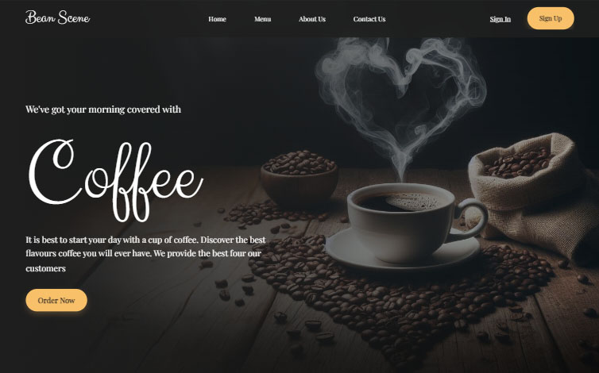

# Coffee Landing Page

In this project I use sass to build this landing page inspired by a design taken from figma. 

[Live preview](https://coffee-landpage.pages.dev/)

## Features
- Responsive
- Touch swipe carousel
- Sticky navigation bar

## Original Design
[layout](https://github.com/erme07/coffee-landpage/blob/bf7b1bee37e61649606cf5ea91f0badc07a2614c/original_design.png)

## Acknowledgement
Thanks to [Mohammed](https://www.figma.com/@thisuix571) Jawed for the [design](https://www.figma.com/community/file/1201418433329014860)
